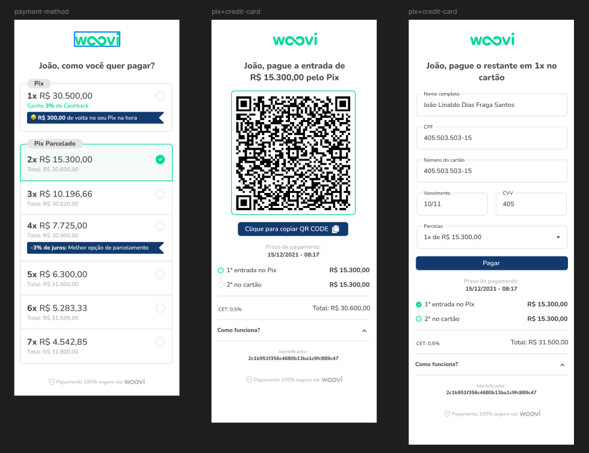

## Frontend Engineer Challenge

This Repository contains the [Frontend Engineer Challenge](https://woovi.com/jobs/challenges/frontend-engineer/)

[Challenge Figma](https://www.figma.com/design/hv1LgD7oNrtlmfWgKBG6PF/Woovi-Desafio-Front)

## My Solution

### Boilerplate

This projects uses the [Vite Boilerplate](https://github.com/diasjoaovitor/vite-boilerplate), a setup with `Prettier`, `Eslint`, `Commit Linter`, `Component Generator`, `Automatized Tests`, `Continuous Integration`, etc.

## Contact

- jvitordiass@outlook.com
- [LinkedIn](https://www.linkedin.com/in/diasjoaovitor/)
- [Curriculum](https://gist.github.com/diasjoaovitor/4548859f6934c991ada24ea1a663cd86)

